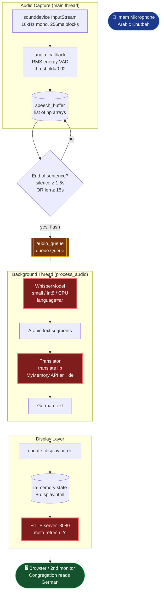

# MinbarAI — Architecture (Mermaid)

Bottlenecks shown in **red**. Source: [architecture.mmd](architecture.mmd).

## Bottleneck breakdown

| Node | Why slow | Fix |
|---|---|---|
| WhisperModel | `small` int8 on CPU, 3–8s per sentence | `tiny` model, or GPU+`float16`, or streaming partials |
| Translator (MyMemory) | network call, not offline, rate-limited | local Marian-NMT `Helsinki-NLP/opus-mt-ar-de` or NLLB-200 |
| HTTP meta-refresh 2s | client polls every 2s, up to 2s lag | WebSocket / SSE push from server |

Other tunables (not bottlenecks but affect feel): `SILENCE_DURATION=1.5s` adds fixed lag before each translation; `MIN_BUFFER_SIZE=6` prevents short bursts.
